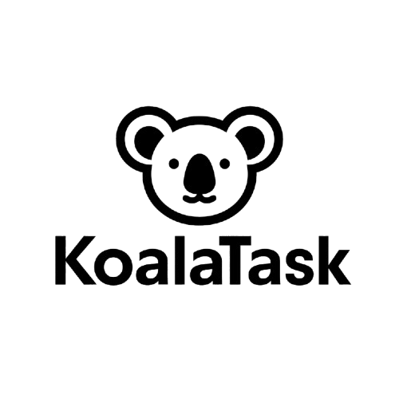

  

# Koala Task

Koala akan membantu pekerjaan anda — aplikasi manajemen tugas berbasis Kanban dengan kolaborasi tim, notifikasi real‑time, dan dukungan PWA.

## Fitur Utama

- Workspace & Proyek
  - Multi‑workspace dengan `slug` dan ikon, default project & board per workspace
  - Peran anggota: Admin, Member, Viewer; undang/kelola anggota per workspace
  - Aktivitas (activity log) tingkat workspace
- Papan Kanban Interaktif
  - Kolom dengan aksen warna dan batas WIP (opsional)
  - Drag & drop tugas antarkolom dengan urutan berbasis posisi desimal (stabil dan efisien)
  - Sinkronisasi real‑time perubahan papan via SSE
- Manajemen Tugas Lengkap
  - Detail tugas: judul, deskripsi, progres (0–100), tanggal mulai & jatuh tempo
  - Penanggung jawab (assignees) multi‑user per tugas
  - Label proyek (tag) dan pencantuman/pencabutan label per tugas
  - Checklist dan item checklist per tugas
  - Lampiran: unggah file (tersimpan pada `public/uploads`) atau tautan eksternal, pratinjau lampiran
  - Komentar per tugas dengan notifikasi ke penanggung jawab
- Notifikasi & Realtime Events
  - SSE event stream untuk pembaruan papan, komentar baru, perubahan keanggotaan, dan notifikasi personal
  - Penandaan notifikasi sebagai sudah dibaca, pengelolaan notifikasi terbaru
- Dashboard & Produktivitas
  - Ringkasan status lintas workspace (To Do, In Progress, On Review, dst.)
  - Halaman “Tugas Saya” dengan pencarian dan paginasi
  - Kalender bulanan untuk konteks penjadwalan
- Autentikasi & Akses
  - Login/Logout dengan JWT (cookie httpOnly), proteksi rute `/admin` via middleware
  - RBAC per workspace (Admin/Member/Viewer) + peran user global (ADMIN untuk manajemen user)
- Tampilan & PWA
  - UI responsif dengan tema gelap/terang, komponen modern HeroUI
  - Manifest Web App, ikon, dan halaman offline untuk pengalaman PWA dasar

## Tech Stack

- Frontend
  - Next.js 15 (App Router), React 18, TypeScript 5
  - HeroUI v2, Tailwind CSS 4, Framer Motion, next-themes
  - dnd-kit (drag & drop), react-hot-toast (notifikasi UI)
- State & Data Fetching
  - Zustand untuk state klien, Axios dan util fetch kustom (`lib/api.ts`)
  - Server-Sent Events (SSE) untuk pembaruan real‑time (`/api/events`)
- Backend API
  - Next.js Route Handlers (`app/api`): autentikasi, board, tugas, label, checklist, komentar, notifikasi, workspace, users
  - JSON Web Token dengan `jose`, hashing password dengan `bcryptjs`
- Database & ORM
  - Prisma 5 + MySQL
  - Skema: User, Workspace, WorkspaceMember (role), Project, Board, Column, Task, Label, TaskLabel, TaskAssignee, Checklist, ChecklistItem, Comment, Attachment, ActivityLog, Notification
- Visualisasi & Utilitas
  - Chart.js + react-chartjs-2 untuk ringkasan
- Kualitas Kode
  - ESLint 9, Prettier 3, konfigurasi TypeScript dan Tailwind

## Lisensi

Proyek ini dirilis di bawah lisensi MIT. Lihat berkas `LICENSE` untuk detailnya.
